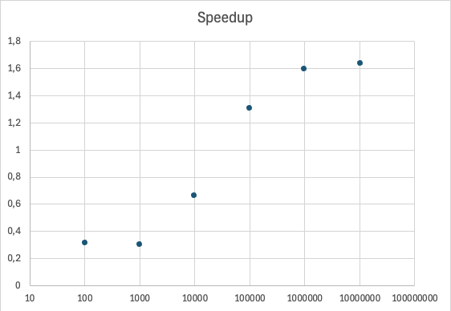

# Convex Hull

Her er min løsning på å finne _convex hull_/konveks innhylling av en mengde punkter. Problemet er løst både sekvensielt og parallelt for å sammenligne kjøretider. 


Speedup er definert som $\frac{sekvensiell-tid}{parallell-tid}$. X-aksen er størrelsen på punkt-mengden, og y-aksen er speedup. 


## Brukerveiledning
For å kompilere
```
javac Oblig4.java
```
For å kjøre
```
java -ea Oblig4 <seed>
```

Programmet kjøres for n = {100, 1_000, 10_000, 100_000, 1_000_000, 10_000_000}

Ved kjøring vil programmet for hver n kjøre sekvensiell og parallell versjon 7 ganger og sammenligne tidene. For n opp til 10_000 vil også programmet tegne alle punktene og innhyllingen av dem. 

Programmet er min besvarelser på en obligatorisk oppgave i emnet IN3030 - Effektiv Parallellprogrammering.
Filene IntList.java, NPunkter17.java og Oblig4Precode.java er prekode vi fikk utdelt, resten er mine filer. 

Hele programmet tar ca.6 sekunder å kjøre. 
